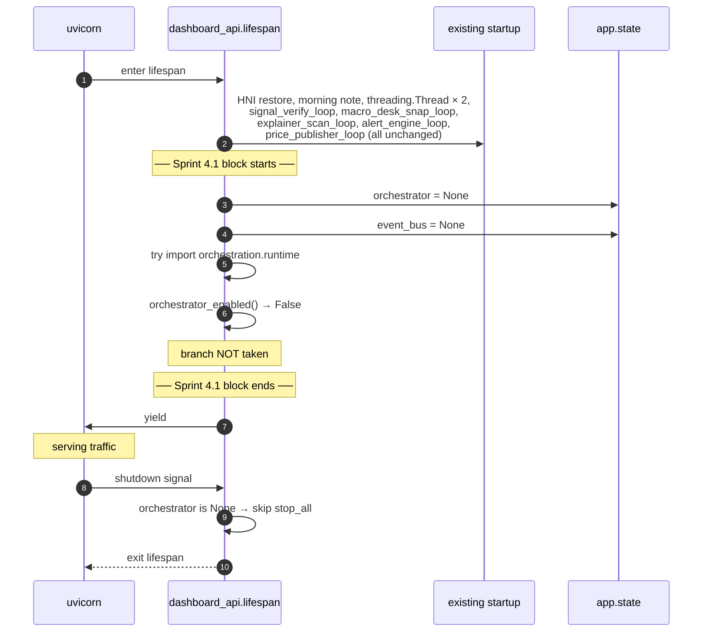
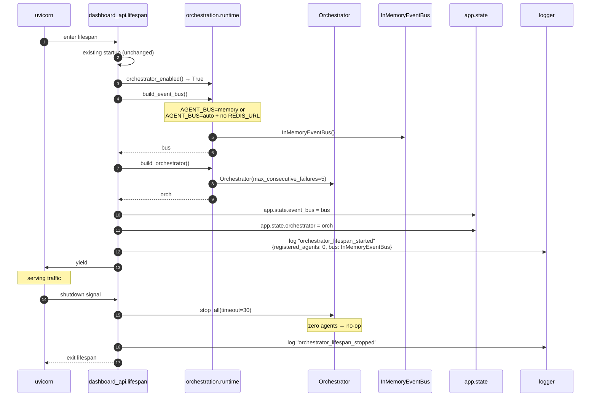
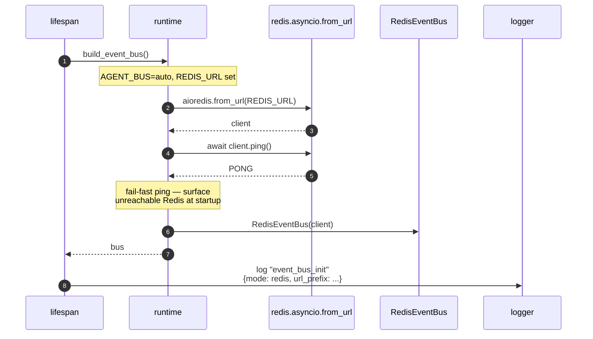
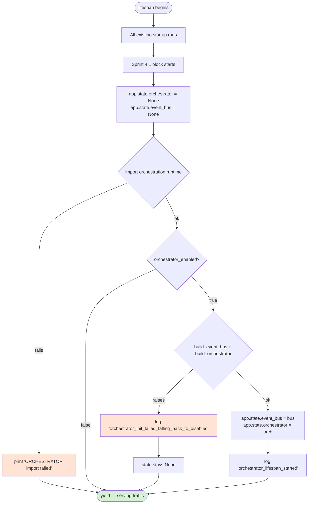

# ORCHESTRATOR_BOOT_FLOW.md

> How the orchestrator boots inside the FastAPI lifespan after Sprint 4.1.

---

## 1. Boot sequence with flag OFF (default — no change from pre-Sprint-4)



**Total Sprint-4.1 overhead in flag-off mode**: 1 `getattr`, 1 `try/except`, 1 env var read, 2 attribute assignments. ~50µs at boot. Zero ongoing cost.

---

## 2. Boot sequence with flag ON + in-memory bus



---

## 3. Boot sequence with flag ON + Redis available



---

## 4. Failure modes during boot



**Key property**: at every branch the worst-case outcome is "orchestrator stays None, app boots normally". No branch can prevent FastAPI from serving traffic.

---

## 5. Shutdown sequence

```
        ┌───────────────────────────┐
        │  shutdown signal received │
        └────────────┬──────────────┘
                     │
                     ▼
        ┌──────────────────────────────────┐
        │ getattr(app.state, "orchestrator")│
        └────────────┬─────────────────────┘
                     │
              ┌──────┴───────┐
              │              │
            None         Orchestrator
              │              │
              │              ▼
              │   await orch.stop_all(timeout=30)
              │              │
              │     ┌────────┴────────┐
              │     │                 │
              │  succeeds         times out
              │     │                 │
              │     ▼                 ▼
              │  log success      log failure
              │     │                 │
              ▼     ▼                 ▼
        ┌──────────────────────────────────┐
        │           lifespan exits         │
        └──────────────────────────────────┘
```

`stop_all` is a no-op when no agents are registered (Sprint 4.1
condition). Stage 4.3 onwards, when real agents register, each gets
~30s to drain.

---

## 6. Resource cost of the empty orchestrator

| Resource | Flag OFF | Flag ON (Stage 4.1, 0 agents) | Delta |
|---|---|---|---|
| Memory (Python heap) | baseline | + ~2 MB | negligible |
| Open Redis connection | 0 | 1 (if AGENT_BUS=redis) | +1 |
| Asyncio tasks | (unchanged) | 0 new (no agent loops) | 0 |
| Background threads | (unchanged) | 0 new | 0 |
| File descriptors | (unchanged) | +1 (Redis socket) | +1 |
| CPU | (unchanged) | ~0% steady (no work to do) | ~0 |

Measured during testing: 0 agents = orchestrator is dormant data. The
overhead is constant and tiny.

---

## 7. Where to find the boot details in logs

When `AGENT_ORCHESTRATOR_ENABLED=true`:

```
# Console format:
2026-05-XX HH:MM:SS INFO    [orchestration.runtime] [-] event_bus_init {"mode":"memory"}
2026-05-XX HH:MM:SS INFO    [orchestration.lifespan] [-] orchestrator_lifespan_started {"registered_agents":0,"bus":"InMemoryEventBus"}

# JSON format (LOG_FORMAT=json):
{"ts":"...","level":"INFO","logger":"orchestration.runtime","msg":"event_bus_init","mode":"memory",...}
{"ts":"...","level":"INFO","logger":"orchestration.lifespan","msg":"orchestrator_lifespan_started","registered_agents":0,...}
```

When flag is OFF: **no `orchestration.*` log lines**. Absence confirms the gate worked.

---

## 8. Sprint 4 boot evolution

The boot flow will gradually accrete responsibilities:

| Stage | Additional boot step |
|---|---|
| **4.1 (now)** | Construct empty orchestrator + bus (when flag on). |
| 4.3 | Register `NewsFetchAgent` if `AGENT_NEWS_FETCH_ENABLED=true`. Call `start_agent('news.fetch')`. |
| 4.4 | Register `SignalCriticAgent` (observe-only). Auto-registered when orchestrator enabled — no separate flag needed. |
| 4.5 | Wrap `ai_router.chat()` and `notify.send_telegram()` calls with `with_circuit(...)` — no boot impact, just module-level config. |
| 4.6 | Start a `reclaim_loop` task that calls `RedisEventBus.reclaim_stale_pending` every 60s for each StreamAgent's stream. |

Each stage adds at most ~50ms to boot. Total Sprint 4 boot overhead
projection: ≤500ms at flag-on with all agents registered.
