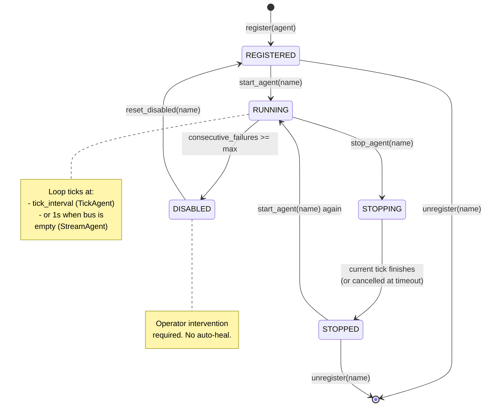
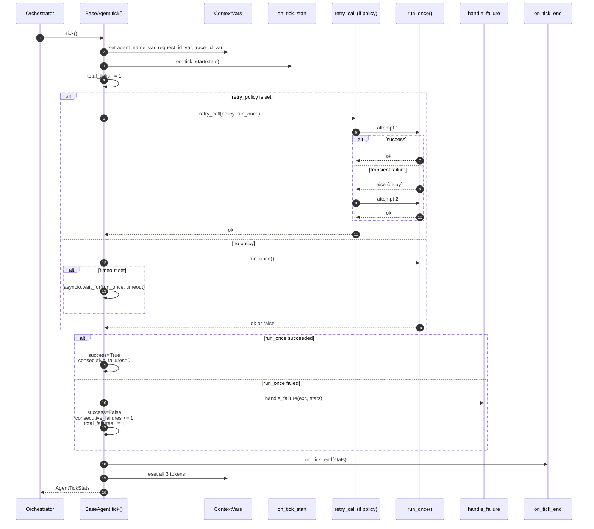
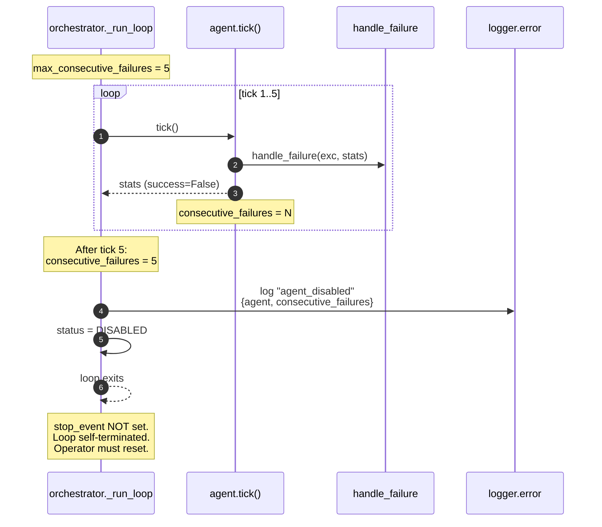

# AGENT_LIFECYCLE_DIAGRAM.md

> What a single agent looks like over time: from `register()` to `STOPPED`
> (or `DISABLED`). Includes tick-internal sequence, ContextVar window,
> and the failure→retry→recovery thread.

---

## 1. Agent status machine (orchestrator-level)



**Transitions are explicit**:
- `register` is idempotent? **No** — duplicate name raises. Re-register requires unregister first.
- `start` from REGISTERED or STOPPED is fine.
- `start` from DISABLED raises — you must `reset_disabled` first.
- `unregister` requires status != RUNNING (caller must stop first).

---

## 2. One tick — what happens between `tick()` enter and exit



**Notes**:
- `handle_failure` is called from within `tick()`. It does NOT raise (by contract). If it did, it would propagate and bypass the consecutive-failure tally.
- ContextVars are reset in a `finally` block — even an exception inside `on_tick_end` won't leak context.
- `stats.events_emitted` is incremented inside `emit_event()` and reflected in the AgentTickStats return value.

---

## 3. The ContextVar window

```
time ──►
                                                 reset
       set                                       (finally)
        │                                           │
        ▼                                           ▼
        ┌───────────────────────────────────────────┐
        │              (one tick)                   │
        │  any log line emitted here picks up:      │
        │    agent_name = "news.fetch"              │
        │    request_id = "abc123def456" (tick_id)  │
        │    trace_id   = "<uuid>"                  │
        │    tenant_id  = "-"  (or set by handler)  │
        └───────────────────────────────────────────┘
       ▲                                           ▲
       │                                           │
   tick() enters                              tick() exits

         Outside this window, ContextVars revert
         to their default ("-") so a NEXT tick
         starts clean.
```

If `run_once()` calls `asyncio.create_task(other_coro)`, the new task
gets a **copy** of the context at creation time. So the spawned task
sees the same agent_name + request_id + trace_id. Sprint 3 doesn't
explicitly use this, but it's the foundation Sprint 4's fan-out
patterns will rely on.

---

## 4. Failure-and-retry timeline

```
attempt 1 ──fail──┐                                attempt 2
                  │                                    │
                  ▼                                    ▼
  ░░░░░░░░░░░ ░░░░░░░░░░░░░░░░░░░░░░░░░░ ░░░░░░░░░░░░░░░░░░░░░░░░░░
  │            │                          │
  │            │                          │
  └─ run_once  └─ delay_for(2)            └─ run_once (succeeds)
     fails       = base_delay × jitter        run_once result returned
                 (e.g. 1.0s ± 10%)            consecutive_failures = 0
                                              total_ticks += 1
                                              success=True

  ─── tick() span ──────────────────────────────────────────────────►

  consecutive_failures counter:
    - Does NOT increment on per-attempt failure (within retry_call)
    - Increments by 1 ONLY if all attempts fail (RetryExhausted)
```

This is by design: an agent that occasionally needs a retry isn't "sick"
— it's recovering. Only persistent failures (all attempts exhausted)
count toward the DISABLED threshold.

---

## 5. The "agent disabled" path



**Operator recovery**:
```bash
# 1. Inspect /api/agents to confirm status
curl http://localhost:8001/api/agents | jq '.[] | select(.status=="disabled")'

# 2. Check the agent's last error in logs
docker logs market-terminal | jq 'select(.agent=="news.fetch" and .level=="ERROR")' | tail -10

# 3. Fix the underlying cause (rotate API key, etc.)

# 4. Reset
curl -X POST http://localhost:8001/api/agents/news.fetch/reset

# 5. Restart
curl -X POST http://localhost:8001/api/agents/news.fetch/start
```

Endpoints in steps 4–5 are Sprint 4 work — Sprint 3 only ships the
underlying methods (`reset_disabled`, `start_agent`).

---

## 6. Lifecycle event log examples (JSON format, post-Sprint-2)

```
{"ts":"2026-05-19T10:00:00.000Z","level":"INFO","logger":"agents.orchestrator","msg":"agent_registered","request_id":"-","tenant_id":"-","trace_id":"-","agent":"-","family":"news","version":"1"}

{"ts":"2026-05-19T10:00:01.000Z","level":"INFO","logger":"agents.orchestrator","msg":"agent_started","request_id":"-","tenant_id":"-","trace_id":"-","agent":"-","agent_name":"news.fetch"}

{"ts":"2026-05-19T10:00:01.123Z","level":"INFO","logger":"agent.news.news.fetch","msg":"news_fetched","request_id":"abc123def456","tenant_id":"-","trace_id":"af23bf...","agent":"news.fetch","source":"rss","count":12}

{"ts":"2026-05-19T10:00:02.456Z","level":"ERROR","logger":"agent.news.news.fetch","msg":"agent_tick_failed","request_id":"def456abc789","tenant_id":"-","trace_id":"bf12cd...","agent":"news.fetch","consecutive_failures":1,"exc_type":"ConnectionError","exc_msg":"reset by peer"}

{"ts":"2026-05-19T10:05:00.000Z","level":"ERROR","logger":"agents.orchestrator","msg":"agent_disabled","request_id":"-","tenant_id":"-","trace_id":"-","agent":"-","agent_name":"news.fetch","consecutive_failures":5}
```

Grep tools used routinely:
```bash
# All logs for one tick:
docker logs market-terminal | jq 'select(.request_id=="abc123def456")'

# All errors for one agent in the last 1000 lines:
docker logs market-terminal | tail -1000 | jq 'select(.agent=="news.fetch" and .level=="ERROR")'

# Tick latency over time (Sprint 5 with metrics; today via log mining):
docker logs market-terminal | jq 'select(.msg=="agent_tick_completed") | {ts, agent, duration_ms}'
```

The last query depends on Sprint 4 adding `agent_tick_completed` log —
currently the tick logs only on failure. Sprint 4 task: emit
`agent_tick_completed` in `on_tick_end` once metrics are wired.

---

## 7. Sprint 4's first agent — projected lifecycle

```
t=0    register(NewsFetchAgent)              status=REGISTERED
t=1    start_agent("news.fetch")              status=RUNNING
       loop: tick → emit news.fetched → sleep tick_interval
       ...
t=60s  first emit → events:news:fetched      stream_length=1
t=60s  log: "tick_complete" agent="news.fetch" duration_ms=420
t=120s second emit → events:news:fetched     stream_length=2 (or 1 if consumed)
       ...
       eventually:
t=1h   stop_agent("news.fetch")               status=STOPPING → STOPPED
       last in-flight tick finishes
       loop exits cleanly
       resources released
```

This is the model. Sprint 4 verifies it observationally before scaling
the pattern to more families.
