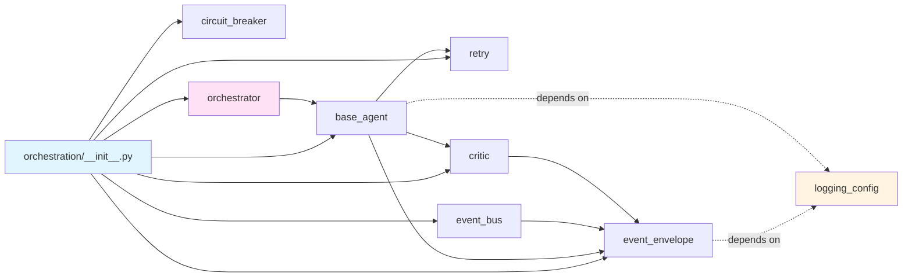
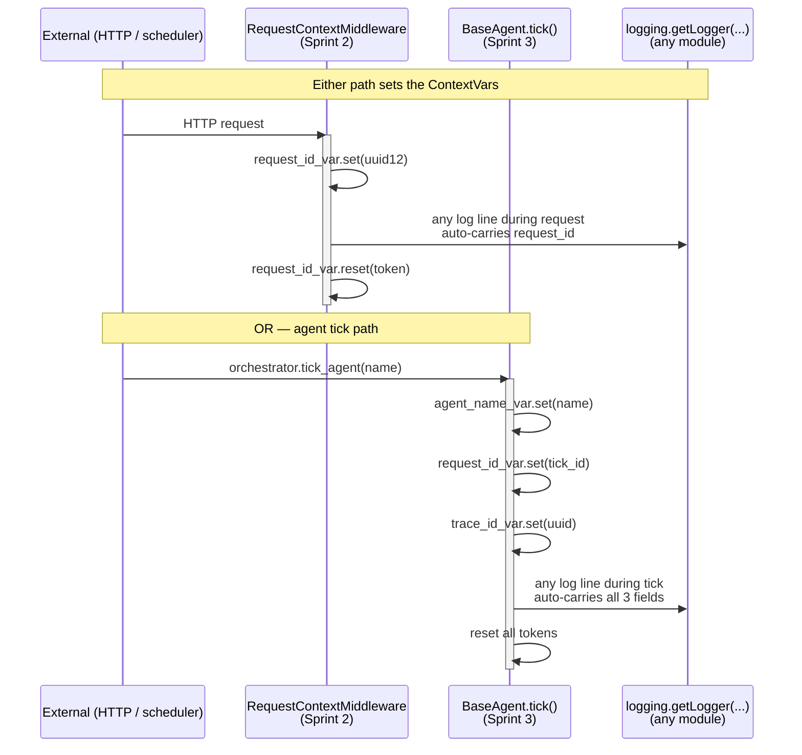
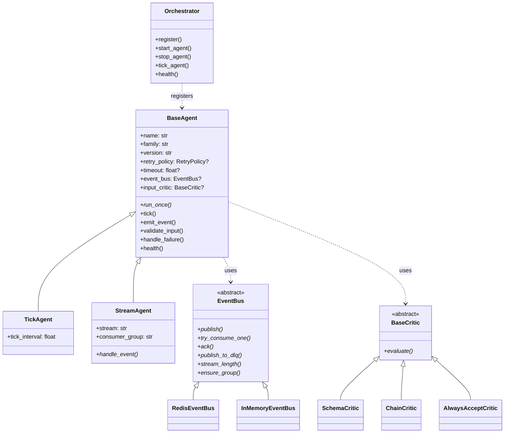

# ARCHITECTURE_DIAGRAMS.md

> Pre-Sprint-4 stabilization artifact. Snapshots the system shape after
> Sprint 3 ships. Mermaid + ASCII. ASCII chosen where topology beats
> graph rendering; Mermaid where state and sequence matter.

---

## 1. Process topology (single-process, single-VPS)

```
┌────────────────────────────────────────────────────────────────────┐
│  Hostinger VPS  (Ubuntu, single host)                              │
│                                                                    │
│   ┌──────────────┐    ┌───────────────────────────────────────┐    │
│   │ Caddy:443/80 │───►│ market-terminal container             │    │
│   │  TLS + proxy │    │   uvicorn :8001                       │    │
│   └──────────────┘    │   dashboard_api:app (FastAPI)         │    │
│                       │                                       │    │
│                       │   Sprint 2 middleware:                │    │
│                       │     RequestContextMiddleware          │    │
│                       │     (request_id / latency / log)      │    │
│                       │                                       │    │
│                       │   Sprint 3 library (NOT YET WIRED):   │    │
│                       │     orchestration/* — agents,         │    │
│                       │     event bus, retry, circuit,        │    │
│                       │     critic, orchestrator              │    │
│                       │                                       │    │
│                       │   /app/db/  (volume)                  │    │
│                       │     18× SQLite                        │    │
│                       └────────┬──────────────────────────────┘    │
│                                │                                   │
│                       ┌────────▼──────┐                            │
│                       │ redis :6379   │  256MB cap, allkeys-lru    │
│                       │  hot state +  │                            │
│                       │  (future)     │                            │
│                       │  Sprint 4+    │                            │
│                       │  event streams│                            │
│                       └───────────────┘                            │
└────────────────────────────────────────────────────────────────────┘
                  │
                  └─► docker logs → host stdout → (Sprint 5+) log shipper
```

**Key fact post-Sprint-3**: the orchestration library lives in the
container image but **no code path imports it**. Sprint 4 makes the
first import in `dashboard_api.py` (FastAPI lifespan), feature-flagged.

---

## 2. Package layout (post-Sprint-3)

```
core/
├── dashboard_api.py            FastAPI app, routes, middleware
├── run.py                      uvicorn launcher with setup_logging()
├── logging_config.py           Sprint 2: JsonFormatter, ContextVars
├── logging_middleware.py       Sprint 2: RequestContextMiddleware
│
├── orchestration/              ← Sprint 3 package (library only)
│   ├── __init__.py             public re-exports
│   ├── event_envelope.py       EventEnvelope dataclass
│   ├── retry.py                RetryPolicy, with_retry, retry_call
│   ├── circuit_breaker.py      CircuitBreaker, CircuitRegistry
│   ├── critic.py               BaseCritic, Schema/Chain/AlwaysAccept
│   ├── base_agent.py           BaseAgent, TickAgent, StreamAgent
│   ├── event_bus.py            EventBus ABC + Redis + InMemory
│   └── orchestrator.py         registry, lifecycle, health
│
├── tests/                      121 Sprint-1+2 + 67 Sprint-3 + ~74 stage tests
├── scripts/
│   ├── pin-deps.sh             Sprint 2 — lockfile gen
│   └── sim/                    Pre-Sprint-4 simulation scripts
│       ├── sim_logging_load.py
│       ├── sim_streams_recovery.py
│       ├── sim_retry.py
│       └── sim_circuit_breaker.py
├── reviews/                    Architecture + sprint records
└── (105 pre-existing modules — flat layout)
```

---

## 3. Dependency direction (post-Sprint-3)



Internal acyclic, single-direction. `logging_config` (Sprint 2) is the
only external dependency from `orchestration/` — clean separation.

**No imports go in the reverse direction**:
- `dashboard_api` does NOT import `orchestration`
- `run.py` does NOT import `orchestration`
- The 105 pre-existing modules do NOT import `orchestration`

---

## 4. Context-variable lifetime (Sprint 2 + Sprint 3 wiring)



Both entry points (HTTP middleware and agent tick) use the same
ContextVars, so any log line emitted during either path inherits the
right correlation IDs. **No code change needed in the 8 existing
modules that use `logging.getLogger()`** — they pick up context
automatically.

---

## 5. Public API surface — orchestration package



15 public types. Inheritance is shallow (max depth 2) by design — keeps
the contract clear without forcing inheritance gymnastics.

---

## 6. Where Sprint 4 will plug in

```
┌─────────────────────────────────────────────────────────────┐
│  dashboard_api.py  (Sprint 4 changes shown in red)          │
│                                                             │
│   app = FastAPI(lifespan=lifespan)                          │
│                                                             │
│   @asynccontextmanager                                      │
│   async def lifespan(app):                                  │
│   ┌───────────────────────────────────────────────────┐     │
│   │ + if FLAG_AGENT_ORCHESTRATOR_ENABLED:             │     │
│   │ +     bus = RedisEventBus(redis_async_client)     │     │
│   │ +     orch = Orchestrator()                       │     │
│   │ +     # Sprint 4: register ONE wrapped agent     │     │
│   │ +     # await orch.start_all()                    │     │
│   │ +     app.state.orchestrator = orch               │     │
│   └───────────────────────────────────────────────────┘     │
│       # existing startup ...                                │
│       yield                                                 │
│   ┌───────────────────────────────────────────────────┐     │
│   │ + if FLAG_AGENT_ORCHESTRATOR_ENABLED:             │     │
│   │ +     await app.state.orchestrator.stop_all(...)  │     │
│   └───────────────────────────────────────────────────┘     │
│                                                             │
│   + @app.get("/api/agents")                                 │
│   + def get_agents():                                       │
│   +     return [h.to_dict()                                 │
│   +             for h in app.state.orchestrator.health()]   │
│   +                                                         │
│   + @app.get("/api/circuits")                               │
│   + def get_circuits():                                     │
│   +     return default_registry.snapshot()                  │
└─────────────────────────────────────────────────────────────┘
```

These are the **only** changes Sprint 4 needs to dashboard_api.py
itself. Real agents are added one at a time via `orch.register(...)`
behind their own feature flags.

---

## 7. What's NOT in this diagram (deferred)

| Component | When | Why deferred |
|---|---|---|
| LangGraph | Sprint 5+ conditional | No reasoning chain currently demands it |
| Prometheus `/metrics` | Sprint 5 | No metric question is unanswered today |
| OpenTelemetry tracing | Sprint 4+ conditional | Logs + duration_ms cover the common debugging case |
| Per-tenant routing | Sprint 4+ | Single-tenant operations today; multi-tenant data already isolated by SQLite per-user files |
| Scale-out (multiple containers) | Sprint 7+ gated | Single-process suffices until memory/CPU pressure shows up |
| Log shipping (Loki/CW) | When needed | Docker `json-file` + `docker logs` handle current volume |
