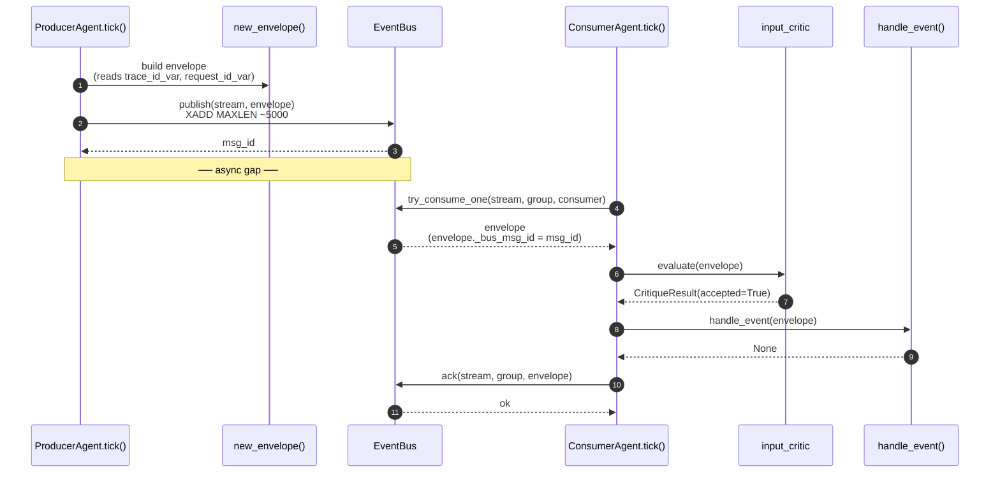
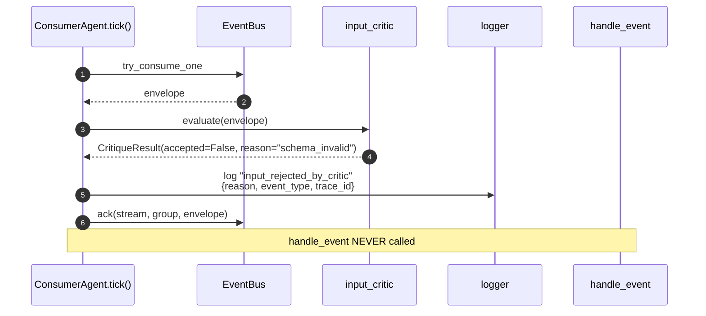
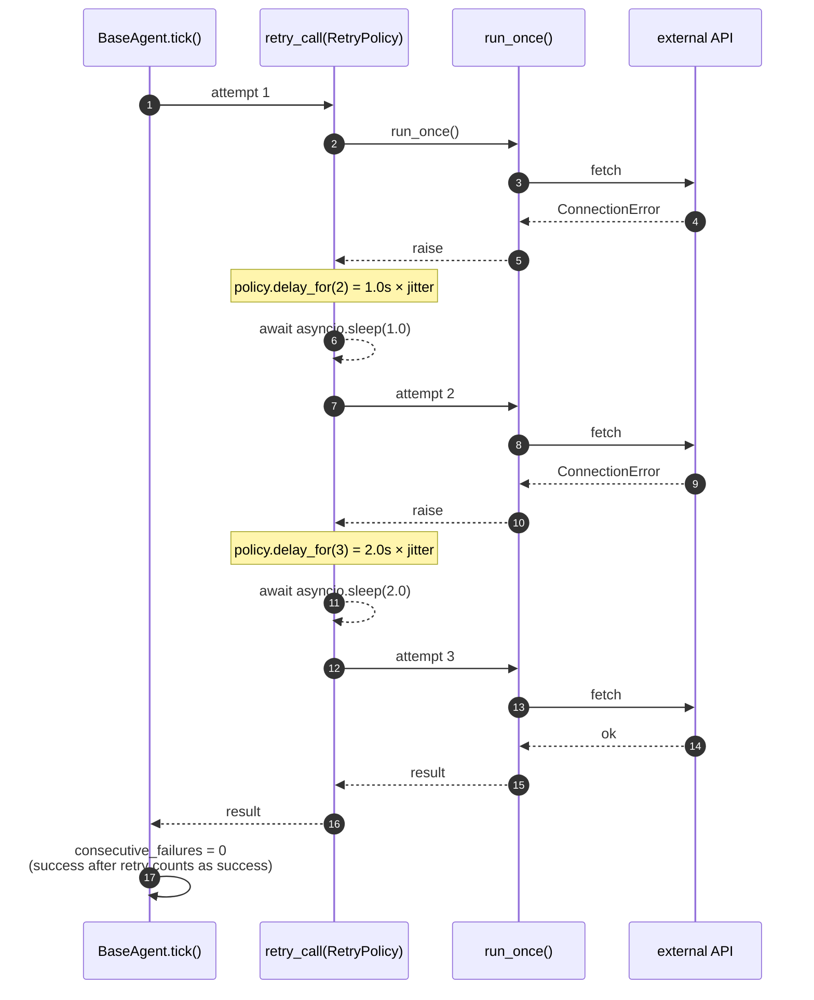
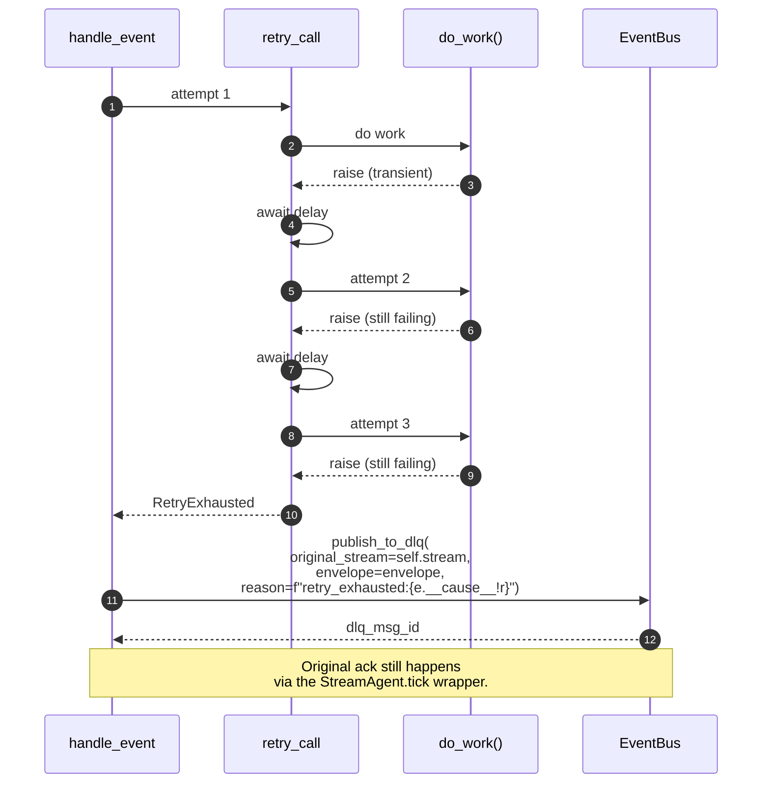
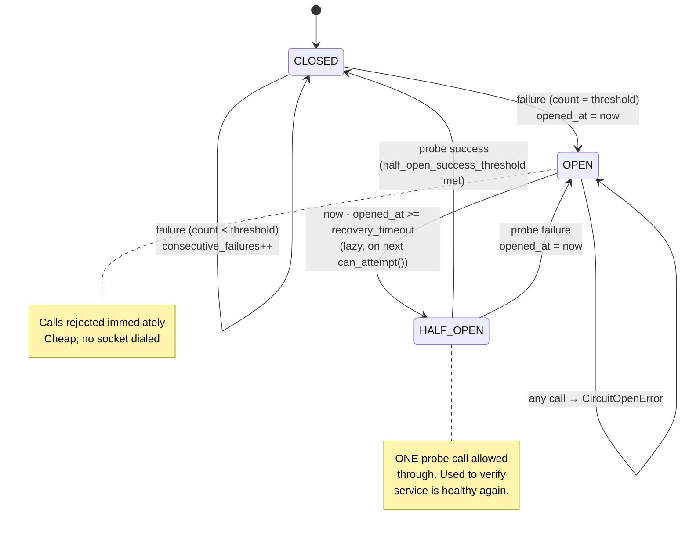
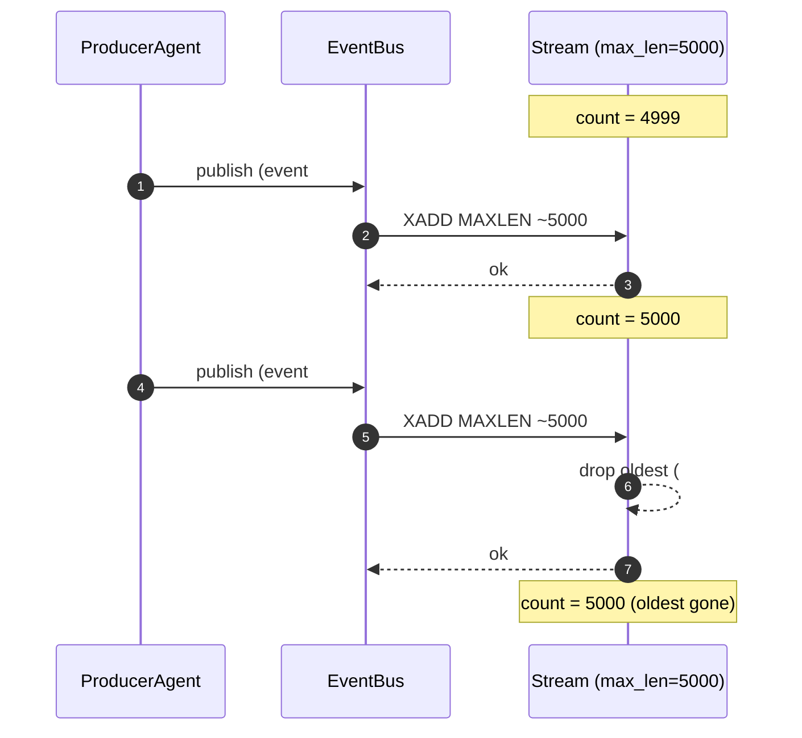
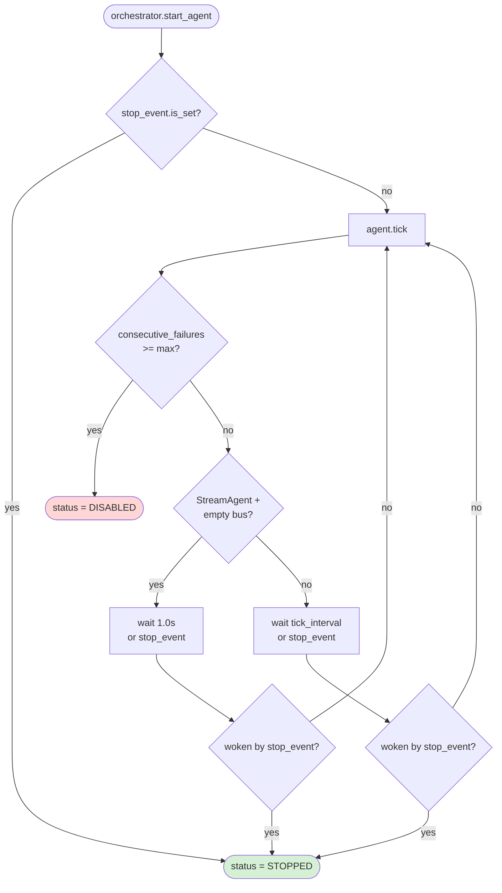
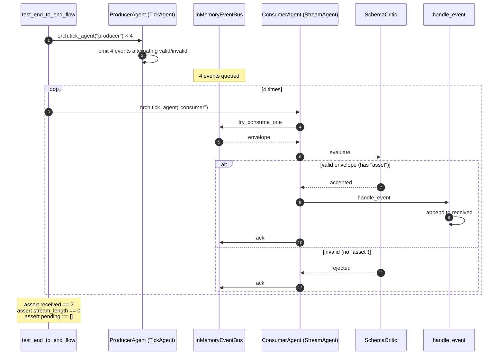

# ORCHESTRATION_FLOW.md

> Sequence diagrams for the data paths through the Sprint-3 orchestration
> primitives. Each shows: happy path → critic-reject path → retry path →
> circuit-open path → DLQ path.

---

## 1. Happy path: producer → bus → critic → consumer → ack



**Invariants**:
- Envelope is unchanged from producer to handler (read-only contract).
- Ack runs after handler, in a finally block — even handler exceptions
  result in an ack (no reprocess). Failures are handled via DLQ, not
  re-delivery.
- `_bus_msg_id` is a non-dataclass attribute — clean `payload`.

---

## 2. Critic-reject path: handler is NOT called



**Why ack on reject**: rejection is a durable decision. Reprocessing
would just reject again. The audit trail is in the structured log.

---

## 3. Retry path inside one tick (transient external failure)



**Notes**:
- Retries are bounded by `RetryPolicy.max_attempts` (hard cap 20).
- If the exception's classification is NOT in `retryable_categories`,
  the policy fails fast on attempt 1 — no retry.
- Time spent retrying counts against `timeout` (if set). Pick `timeout
  > sum(delay_for(1..max_attempts))` or you'll abort mid-retry.

---

## 4. Retry exhausted → DLQ



**DLQ semantics**:
- Same envelope, with `payload._dlq_reason` and `payload._dlq_original_stream` added.
- Lands in `dlq:<family>:<event_type>` parallel stream.
- No automatic replay — human inspects, fixes, manually re-publishes.

---

## 5. Circuit breaker path: open circuit short-circuits the call

```mermaid
sequenceDiagram
    autonumber
    participant A as agent.run_once
    participant CB as CircuitBreaker("groq")
    participant EXT as Groq API

    Note over CB: state = OPEN<br/>(opened 5s ago, recovery_timeout=30s)

    A->>CB: call(lambda: groq_complete(...))
    CB->>CB: _maybe_half_open()<br/>(too soon; still OPEN)
    CB-->>A: raise CircuitOpenError

    Note over A: Caller decides:<br/>A. serve stale<br/>B. fall back<br/>C. queue for later

    A->>A: cache.get("intel:current")<br/>(graceful degradation)
```

---

## 6. Circuit breaker recovery path



**Per-service defaults** (per `CIRCUIT_BREAKER_PLAN.md`):

| Service | threshold | recovery_timeout |
|---|---|---|
| groq | 5 | 30s |
| anthropic | 3 | 60s |
| yfinance | 8 | 60s |
| telegram | 10 | 10s |
| nse | 5 | 60s |

---

## 7. Backpressure on a full stream (MAXLEN cap)



**Implication**: a slow consumer can lose events if the producer's rate
× backlog time > 5000. Mitigation: raise `max_len`, add a dedicated
consumer, or split the stream by partition. Sprint 5 adds Prometheus
metrics for backlog so you can detect this *before* it's an outage.

---

## 8. Orchestrator's bounded loop (per agent)



**Two ways to exit cleanly**:
1. **Caller-requested** (`stop_agent` sets stop_event) — graceful, current
   tick finishes first.
2. **Self-disabled** (consecutive failures hit threshold) — fail-safe,
   needs operator `reset_disabled` to restart.

Never an infinite loop: every iteration awaits either a fixed interval
or `stop_event.wait()`. Both are interruptible by cancellation.

---

## 9. End-to-end smoke (the test that validates the whole chain)



This is `tests/test_orchestration_smoke.py::test_end_to_end_flow` —
the canonical "did Sprint 3 build the right thing" verification.
